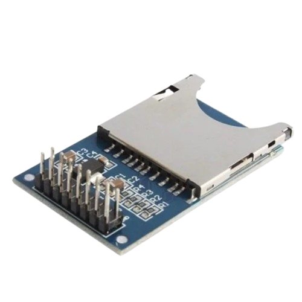

# SD Card — Telemetria 2026

<p align="center">
  
</p>

Módulo responsável por salvar os dados da telemetria em um cartão SD.

O SD Card funciona como uma redundância dos dados enviados pela telemetria, mantendo uma cópia local das informações.

## Bibliotecas

O módulo utiliza:

```cpp
#include <SPI.h>
#include <SD.h>
```

Essas bibliotecas são utilizadas para a comunicação SPI e para acessar o cartão SD.

---

## Comunicação SPI

O cartão SD utiliza 4 sinais principais:

| Pino | Função |
|---|---|
| MOSI | Envia dados para o SD |
| MISO | Recebe dados do SD |
| SCK | Clock da comunicação |
| CS | Seleciona o cartão SD |

Também são necessários:

| Pino | Função |
|---|---|
| VCC | Alimentação |
| GND | Terra |

---

## Arduino UNO

| SD Card | Arduino UNO |
|---|---|
| MOSI | D11 |
| MISO | D12 |
| SCK | D13 |
| CS | D10 |
| GND | GND |

No código:

```cpp
const int SD_CS = 10;
```

---

## ESP32

Configuração SPI comum:

| SD Card | ESP32 |
|---|---|
| MOSI | GPIO 23 |
| MISO | GPIO 19 |
| SCK | GPIO 18 |
| CS | GPIO 5 |
| GND | GND |

No código:

```cpp
const int SD_CS = 5;
```

---

## ESP32-S3

Os pinos SPI podem variar dependendo da placa ESP32-S3 utilizada.

Consulte o pinout da sua placa antes da conexão.

Exemplo:

| SD Card | ESP32-S3 |
|---|---|
| MOSI | GPIO 11 |
| MISO | GPIO 13 |
| SCK | GPIO 12 |
| CS | GPIO 10 |
| GND | GND |

No código:

```cpp
const int SD_CS = 10;
```

> **Atenção:** os pinos do ESP32-S3 acima são apenas um exemplo. Sempre confira o pinout da placa utilizada.

---

## Arquivo CSV

O módulo cria automaticamente:

```text
telemetria.csv
```

O arquivo possui o seguinte formato:

```csv
tempo,tensao,corrente,temperatura
1000,24.50,5.20,31.40
2000,24.60,5.30,31.50
```

Os dados são adicionados ao final do arquivo a cada gravação.

---

## Funções

### Inicializar o SD

```cpp
iniciarSD();
```

Inicializa o cartão SD.

### Criar o arquivo

```cpp
criarArquivoSD();
```

Cria `telemetria.csv` caso ele ainda não exista.

### Salvar dados

```cpp
salvarDadosSD(
    tempo,
    tensao,
    corrente,
    temperatura
);
```

Adiciona uma nova linha ao CSV.

---

## Exemplo

```cpp
void setup() {

  Serial.begin(115200);

  iniciarSD();
  criarArquivoSD();
}

void loop() {

  unsigned long tempo = millis();

  float tensao = 24.5;
  float corrente = 5.2;
  float temperatura = 31.4;

  salvarDadosSD(
    tempo,
    tensao,
    corrente,
    temperatura
  );

  delay(1000);
}
```

---

## Estrutura

O módulo foi desenvolvido para ser simples e reutilizável.

```text
Telemetria-2026/
├── Telemetria-2026.ino
└── SDCard.ino
```

O `SDCard.ino` contém toda a lógica relacionada ao cartão SD, enquanto o código principal apenas utiliza suas funções.
